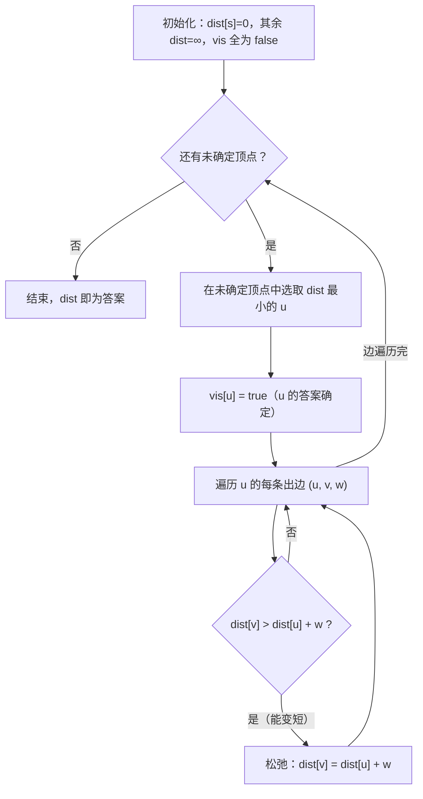
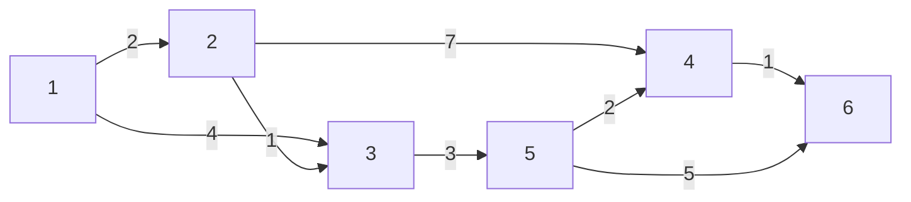
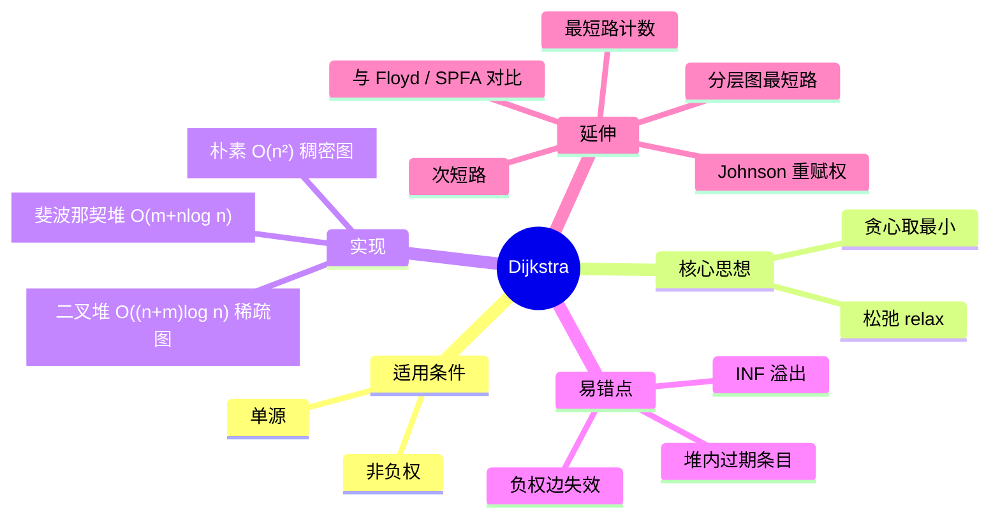

[[主论-单源最短路]]
## 一、它叫什么名字？

**Dijkstra 最短路算法**（迪杰斯特拉算法），由荷兰计算机科学家 Edsger W. Dijkstra 于 1959 年提出。

它解决的是**单源最短路问题**（Single-Source Shortest Path, SSSP）：

> 给定一张带权有向图（或无向图）$G=(V,E)$ 和一个起点 $s$，求 $s$ 到图中**所有其他顶点**的最短路径长度。

## 二、它在 OI 中的地位有多重要？

- 是**图论板块的地基性算法**，所有高级最短路技巧（分层图最短路、双堆 Dijkstra、Johnson 重赋权……）都以它为出发点。
- 它本身既能直接出题，也频繁作为**子过程**嵌入其他算法中（例如：预处理最短路 + 二分答案、最短路计数、K 短路）。
- 掌握了 Dijkstra，你才真正"看见"了最短路问题；没有它，后面的一切都无从谈起。

## 三、什么场景该用它？（适用条件）

| 条件 | 是否满足 |
|---|---|
| 求**单源**最短路（一个起点 → 所有点） | ✅ 擅长 |
| 边权**非负**（$\ge 0$） | ✅ **硬性要求** |
| 存在**负权边** | ❌ 会得出错误答案，改用 SPFA / Bellman-Ford |
| 要求**任意两点**之间最短路 | ⚠️ 可跑 $n$ 次，但通常 Floyd 更方便 |

一句话：**只要边权非负、求单源最短路，首选 Dijkstra。**

## 四、核心思想：两个关键词

### 关键词 1：松弛（Relaxation）

对一条边 $u \xrightarrow{w} v$，如果"绕道经过 $u$"能让到 $v$ 的距离变短，就更新它：

$$
\mathrm{dist}[v] = \min\big(\mathrm{dist}[v],\ \mathrm{dist}[u] + w(u,v)\big)
$$

这条式子是整个最短路理论的**基石**。理解它：原来到 $v$ 的距离是 $\mathrm{dist}[v]$，现在发现先到 $u$ 再走这条边，花了 $\mathrm{dist}[u]+w$，哪个小就用哪个。

### 关键词 2：贪心选择

维护两个集合：

- **已确定集合 $S$**（白色顶点）：到这些点的最短距离已经板上钉钉，不会再变；
- **未确定集合**（蓝色顶点）：还在"围观"中。

每次从未确定集合中取出 **$\mathrm{dist}$ 最小的顶点 $u$**，宣布它的答案确定，并入 $S$，然后用它的出边对邻居做一轮松弛。

> 为什么敢这么"贪心"？直觉是：当前 $\mathrm{dist}$ 最小的未确定顶点，不可能再通过别的未确定点变得更短——因为别的点本来就比它远，而边权又非负，绕过去只会更长。这个直觉会在第七节给出严格证明。

## 五、符号约定（先把每个变量说清楚）

$$
\begin{aligned}
V &: \text{顶点集合，} n = |V| \text{ 为顶点数}\\
E &: \text{边集合，} m = |E| \text{ 为边数}\\
s &: \text{源点（起点）}\\
w(u,v) &: \text{边 } u\to v \text{ 的权值（非负）}\\
\mathrm{dist}[v] &: \text{当前已知的 } s\to v \text{ 的最短距离上界（初始：}\mathrm{dist}[s]=0\text{，其余 }+\infty\text{）}\\
vis[v] &: \text{布尔标记，} v \text{ 是否已进入已确定集合 } S\\
pre[v] &: \text{前驱顶点，用于还原路径（可选）}
\end{aligned}
$$

> 注意 $\mathrm{dist}[v]$ 的语义是**"上界"**：算法运行中它只会单调不增，最终收敛到真正的最短距离。

## 六、算法流程（伪代码 + 流程图）

$$
\begin{array}{l}
\textbf{Algorithm Dijkstra}(G, s)\\
1.\ \ \text{for each } v\in V:\ \mathrm{dist}[v]\gets +\infty,\ vis[v]\gets \text{false};\quad \mathrm{dist}[s]\gets 0\\
2.\ \ \textbf{for } i \gets 1 \textbf{ to } n:\\
3.\ \ \quad u \gets \text{未确定顶点中 } \mathrm{dist} \text{ 最小者}\\
4.\ \ \quad vis[u]\gets \text{true}\\
5.\ \ \quad \textbf{for each } (u,v,w)\in E:\\
6.\ \ \quad\quad \textbf{if } \mathrm{dist}[v] > \mathrm{dist}[u] + w:\quad \mathrm{dist}[v]\gets \mathrm{dist}[u]+w,\ pre[v]\gets u
\end{array}
$$



## 七、完整推样例（带数字代入，一步不漏）

用下面这张有向图，源点 $s=1$：



**第 0 步：初始化**

| 顶点 | 1 | 2 | 3 | 4 | 5 | 6 |
|---|---|---|---|---|---|---|
| dist | **0** | ∞ | ∞ | ∞ | ∞ | ∞ |
| vis | F | F | F | F | F | F |

**第 1 轮：选顶点 1（dist=0）**，用它的两条出边松弛：

- 边 $1\to2$，$w=2$：$\min(\infty,\ 0+2)=2$ → 更新 $\mathrm{dist}[2]=2$
- 边 $1\to3$，$w=4$：$\min(\infty,\ 0+4)=4$ → 更新 $\mathrm{dist}[3]=4$

| 顶点 | 1 | 2 | 3 | 4 | 5 | 6 |
|---|---|---|---|---|---|---|
| dist | 0✅ | 2 | 4 | ∞ | ∞ | ∞ |
| vis | T | F | F | F | F | F |

**第 2 轮：未确定中 dist 最小是 2（=2）**

- 边 $2\to3$，$w=1$：$\min(4,\ 2+1)=\min(4,3)=3$ → 更新 $\mathrm{dist}[3]=3$
- 边 $2\to4$，$w=7$：$\min(\infty,\ 2+7)=9$ → 更新 $\mathrm{dist}[4]=9$

| 顶点 | 1 | 2 | 3 | 4 | 5 | 6 |
|---|---|---|---|---|---|---|
| dist | 0✅ | 2✅ | 3 | 9 | ∞ | ∞ |
| vis | T | T | F | F | F | F |

**第 3 轮：选顶点 3（=3）**

- 边 $3\to5$，$w=3$：$\min(\infty,\ 3+3)=6$ → 更新 $\mathrm{dist}[5]=6$

**第 4 轮：选顶点 5（=6）**

- 边 $5\to4$，$w=2$：$\min(9,\ 6+2)=\min(9,8)=8$ → 更新 $\mathrm{dist}[4]=8$
- 边 $5\to6$，$w=5$：$\min(\infty,\ 6+5)=11$ → 更新 $\mathrm{dist}[6]=11$

**第 5 轮：选顶点 4（=8）**

- 边 $4\to6$，$w=1$：$\min(11,\ 8+1)=\min(11,9)=9$ → 更新 $\mathrm{dist}[6]=9$

**第 6 轮：选顶点 6（=9）**，没有出边，结束。

**最终结果：**

$$
\mathrm{dist} = [\,0,\ 2,\ 3,\ 8,\ 6,\ 9\,]
$$

观察第 4 轮→第 5 轮：对顶点 6，先得到上界 $11$，后来绕道 4 更新成 $9$——这正是"松弛让上界单调下降"的过程。

**路径还原**（若维护了 $pre$）：$pre[6]=4 \to pre[4]=5 \to pre[5]=3 \to pre[3]=2 \to pre[2]=1$，倒序得到 $1\to2\to3\to5\to4\to6$，长度 $2+1+3+2+1=9$ ✓

## 八、正确性证明（为什么贪心得逞？）

**定理**：当顶点 $u$ 从未确定集合被取出（$vis[u]$ 置真）的那一刻，$\mathrm{dist}[u]$ 等于 $s\to u$ 的真正最短距离。

**证明（反证法）**：设 $u$ 是第一个被取出时 $\mathrm{dist}[u]$ 大于真实最短距离 $\delta(s,u)$ 的顶点。取 $s\to u$ 的任意一条最短路径 $P$，设 $P$ 上第一个**位于 $u$ 之后**的未确定顶点为 $y$，它在 $P$ 上的前驱为 $x$（$x$ 已确定或 $x=s$）。

- 因为边权非负，$y$ 在 $P$ 上不晚于 $u$ 出现，故
$$
\mathrm{dist}[y] \le \delta(s,y) \le \delta(s,u) < \mathrm{dist}[u]
$$
（第一个不等号：$x$ 确定时已对 $y$ 松弛成功；第二个：非负边权，$y$ 在 $u$ 之前）。
- 于是存在未确定顶点 $y$ 满足 $\mathrm{dist}[y] < \mathrm{dist}[u]$，与"$u$ 是 dist 最小者"矛盾。∎

**循环不变式**：每轮开始时，对所有 $v\in S$，$\mathrm{dist}[v]=\delta(s,v)$；对所有 $v\notin S$，$\mathrm{dist}[v]$ 是所有"终点在 $S\cup\{v\}$ 内"的路径中的最小长度。初始化与保持均成立，故算法终止时全部正确。

> 注意证明中"边权非负"用在 $\delta(s,y)\le\delta(s,u)$ 这一步——**这就是 Dijkstra 不能处理负权边的根本原因**。

## 九、复杂度分析

| 实现方式 | 选最小值 | 总复杂度 | 适用图 |
|---|---|---|---|
| 朴素数组扫描 | $O(n)$ | $O(n^2 + m)$ | **稠密图**（$m\approx n^2$） |
| 二叉堆（priority_queue） | $O(\log n)$ | $O((n+m)\log n)$ | **稀疏图**（$m\approx n$），OI 最常用 |
| 斐波那契堆 | $O(\log n)$ 摊还 | $O(m + n\log n)$ | 理论最优，竞赛中几乎不写 |

## 十、代码实现（C++17）

### 10.1 稠密图 · 朴素版 $O(n^2)$

```cpp
#include <bits/stdc++.h>
using namespace std;
const int N = 1005, INF = 0x3f3f3f3f;
int n, m, s, g[N][N];          // 邻接矩阵
int dist[N]; bool vis[N];

void dijkstra() {
    memset(dist, 0x3f, sizeof dist); dist[s] = 0;
    for (int i = 1; i <= n; i++) {
        int u = 0;
        for (int j = 1; j <= n; j++)
            if (!vis[j] && (u == 0 || dist[j] < dist[u])) u = j;
        vis[u] = true;
        for (int v = 1; v <= n; v++)
            if (g[u][v] < INF && dist[v] > dist[u] + g[u][v])
                dist[v] = dist[u] + g[u][v];        // 松弛
    }
}
```

### 10.2 稀疏图 · 堆优化版 $O((n+m)\log n)$（竞赛主力）

```cpp
#include <bits/stdc++.h>
using namespace std;
const int N = 1e5 + 5, M = 2e5 + 5, INF = 0x3f3f3f3f;
int n, m, s, head[N], nxt[M], to[M], w[M], cnt;
long long dist[N]; int pre[N]; bool vis[N];

void add(int u, int v, int c) { nxt[++cnt] = head[u]; head[u] = cnt; to[cnt] = v; w[cnt] = c; }

void dijkstra() {
    memset(dist, 0x3f, sizeof dist); dist[s] = 0;
    priority_queue<pair<ll,int>, vector<pair<ll,int>>, greater<>> pq;
    pq.push({0, s});
    while (!pq.empty()) {
        auto [d, u] = pq.top(); pq.pop();
        if (vis[u]) continue;               // 堆中可能残留过期条目
        vis[u] = true;
        for (int i = head[u]; i; i = nxt[i]) {
            int v = to[i];
            if (dist[v] > d + w[i]) {
                dist[v] = d + w[i]; pre[v] = u;
                pq.push({dist[v], v});      // 懒删除：直接压入新版本
            }
        }
    }
}
```

### 10.3 路径还原

```cpp
vector<int> getPath(int t) {
    vector<int> path;
    for (int x = t; x; x = pre[x]) path.push_back(x);
    reverse(path.begin(), path.end());
    return path;
}
```

## 十一、常见坑点与辨析

1. **负权边**：Dijkstra 立即失效。反例：$s\to a$ 权 $2$，$s\to b$ 权 $3$，$a\to b$ 权 $-5$，Dijkstra 会先确定 $a=2$，错过 $b$ 真正的最短 $2+(-5)=-3$（此时 $b$ 已确定，不再更新）。
2. **堆中过期条目**：堆优化版中，同一个顶点可能被压入多次，必须 `if (vis[u]) continue;` 跳过，或者用 `dist` 与堆顶比较双重判断。
3. **$\infty$ 与溢出**：`INF = 0x3f3f3f3f` 加边权可能溢出，大数据请用 `long long`。
4. **与 SPFA 的取舍**：SPFA 是 Bellman-Ford 的队列优化，可处理负权，最坏 $O(nm)$ 且易被卡。非负图一律用堆优化 Dijkstra。
5. **边数与点数的关系**：$m \ge n^2/4$ 时朴素版更快（常数小、无堆开销）；稀疏图务必用堆。
