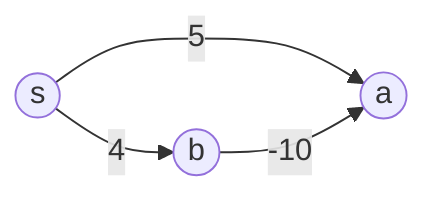
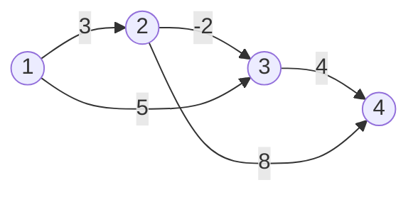
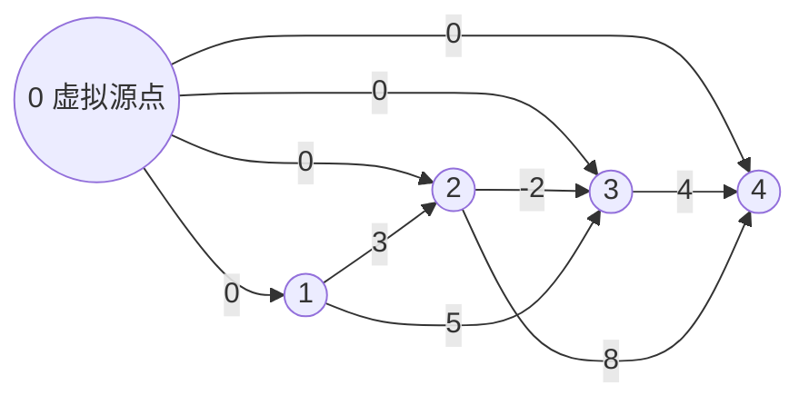
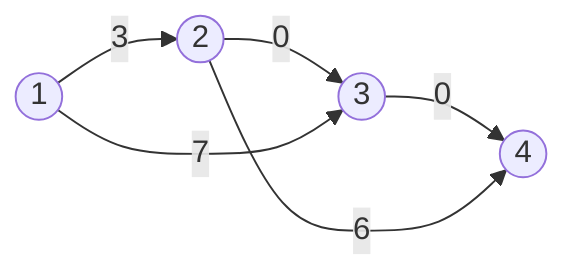
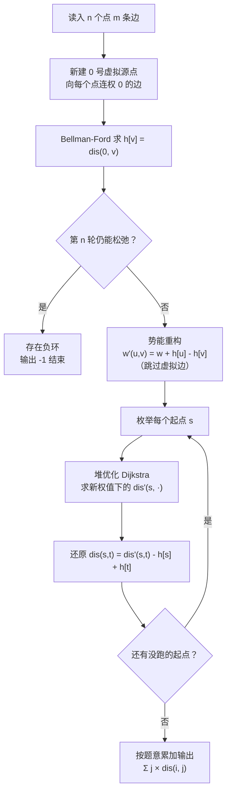

[[主论-多源最短路]]

> 对应题目：[P5905 【模板】全源最短路（Johnson）- 洛谷](https://www.luogu.com.cn/problem/P5905)
>
> 本文阅读方式建议：每个图、每张表都自己动手跟着算一遍，比看十遍都管用。

---

## 第一课 这道题叫什么名字，是什么地位

这道题叫**全源最短路**（All-Pairs Shortest Paths，简称 **APSP**），标准解法是 **Johnson 算法**。

### 1.1 什么叫"全源"

我们以前做的最短路题，绝大多数是**单源最短路**：给定一个起点 $s$，求它到所有其他点的距离。

全源最短路要求更狠：**求出任意两个点之间的距离**。一共有 $n^2$ 个有序点对，每个点对的答案都要算出来。

### 1.2 它在图论中的地位

| 算法 | 解决的问题 | 时间复杂度 | 能处理负边？ | 能判负环？ |
|---|---|---|---|---|
| Dijkstra（堆优化） | 单源最短路 | $O(m \log n)$ | ❌ | ❌ |
| Bellman-Ford | 单源最短路 | $O(nm)$ | ✅ | ✅ |
| SPFA | 单源最短路 | $O(km)$，$k$ 不确定 | ✅ | ✅（但容易被卡） |
| Floyd | 全源最短路 | $O(n^3)$ | ✅ | ✅ |
| **Johnson** | 全源最短路 | $O(nm \log n)$ | ✅ | ✅ |

Johnson 是全源最短路里**效率最高的通用算法**。Floyd 简单但 $O(n^3)$ 太慢，Johnson 把复杂度压到了 $O(nm \log n)$。

### 1.3 为什么这题必须用 Johnson

看题目数据范围：$n \le 3\times10^3$，$m \le 6\times10^3$。

**假如用 Floyd：**

$$O(n^3) = (3\times10^3)^3 = 2.7\times10^{10}$$

这个量级连 C++ 都要跑好几十秒，必超时。

**假如跑 $n$ 轮 SPFA：**

最坏情况 $O(nm) = 3\times10^3 \times 6\times10^3 = 1.8\times10^7$ 一轮，乘上 $n$ 轮就是 $O(n^2m)$，而且 SPFA 是出了名的不稳定——题目出题人明确告诉你"部分数据卡 $n$ 轮 SPFA"，还专门放了卡 SLF 优化的 Hack 数据。

**用 Johnson：**

一遍 Bellman-Ford（$O(nm) \approx 1.8\times10^7$）加 $n$ 轮堆优化 Dijkstra（每轮约 $O(m\log n)$，总共约 $n \cdot m \log n \approx 2\times10^8$ 的常数很小），稳过。

所以：**有负边 + 全源 + $n$ 较大 $\Rightarrow$ 只有 Johnson 一条活路。**

---

## 第二课 核心矛盾：负边和 Dijkstra 为什么势不两立

### 2.1 先回忆 Dijkstra 在干什么

堆优化 Dijkstra 的每一次循环，做的是这么一件事：

1. 从堆顶取出当前距离最小的点 $u$，把它**标记为已确定**；
2. 用 $u$ 去松弛它的邻居。

这个"取最小就确定"的动作是一个**贪心**。贪心要想正确，必须保证一个前提：**以后没有任何办法，能让这个点的距离变得更小。**

### 2.2 负边是怎么破坏这个前提的

假设有一条负权边。看一个最小的反例：



- Dijkstra 先取出距离为 $4$ 的 $b$，确定 $dis(b)=4$；
- 再取出距离为 $5$ 的 $a$，贪心宣布 $dis(a)=5$，封盘；
- 但那条没检查到的边 $b \xrightarrow{-10} a$ 告诉我们：$a$ 的真实距离是 $4+(-10)=-6$！

已经封盘的答案被一条负边推翻了。**负边意味着"先确定下来的点可能不是最优"，Dijkstra 的根基就没了。**

### 2.3 传统路都堵死了

- 想全源 $\Rightarrow$ Floyd $O(n^3)$，超时；
- 有负边 $\Rightarrow$ 不能裸用 Dijkstra；
- $n$ 轮 SPFA $\Rightarrow$ 被 Hack。

于是 Johnson 提出了一个大胆的问题：

> **能不能先做一番"预处理"，把所有负边都变成非负边，同时保证最短路不变，然后放心地跑 $n$ 轮 Dijkstra？**

能。这就是**势能重构**（reweighting），Johnson 的灵魂。

---

## 第三课 势能重构：给每条边"加一头减一头"

### 3.1 先认识一下记号

- 图中有 $n$ 个点，点集记为 $V$；
- 边 $(u,v,w)$ 表示从 $u$ 指向 $v$、权值为 $w$ 的有向边；
- $h(v)$：给每个点 $v$ 人为赋的一个数，叫 $v$ 的**势**（势能，potential）。它是**每个点一个**，不是每条边一个；
- $w(u,v)$：原来的边权；
- $w'(u,v)$：改造后的新边权。

这一节你只需要盯住一个公式。

### 3.2 改造规则

给每条边的新权值定义为：

$$w'(u,v) \;=\; w(u,v) + h(u) - h(v)$$

直观地说：**在边的"出发端"加上出发点的势，在"到达端"减去到达点的势**。一头加、一头减，像把势能从边上"过一遍"。

### 3.3 关键结论：整条路径的新旧权值只差一个"端点常数"

对任意一条从 $s$ 到 $t$ 的路径 $P$，把路径上每条边的新权值全加起来：

$$\sum_{(u,v)\in P} w'(u,v) \;=\; \sum_{(u,v)\in P}\Big(w(u,v) + h(u) - h(v)\Big)$$

把括号拆开、分两组：

$$\sum_{(u,v)\in P} w'(u,v) \;=\; \underbrace{\sum_{(u,v)\in P} w(u,v)}_{\text{旧权值和}} \;+\; \underbrace{\sum_{(u,v)\in P}\big(h(u)-h(v)\big)}_{\text{势的部分}}$$

现在看"势的部分"。路径是 $s \to \cdots \to u \to v \to \cdots \to t$，把每一段的 $h(u)-h(v)$ 依次写出来：

$$h(s) - h(x_1) \;+\; h(x_1) - h(x_2) \;+\; h(x_2) - \cdots \;-\; h(t)$$

中间每一个点的势都出现两次：一次带正号（作为某条边的起点），一次带负号（作为前一条边的终点），**正负抵消，全部消光**，只剩下头尾：

$$\sum_{(u,v)\in P}\big(h(u)-h(v)\big) \;=\; h(s) - h(t)$$

所以得到漂亮的结果：

$$\boxed{\;\sum_{(u,v)\in P} w'(u,v) \;=\; \underbrace{\sum_{(u,v)\in P} w(u,v)}_{\text{旧}} \;+\; \underbrace{h(s) - h(t)}_{\text{只和端点有关}}\;}$$

### 3.4 这个结论意味着什么

注意 $h(s)-h(t)$ **和路径怎么走无关**——不管从 $s$ 到 $t$ 选哪条路，加上的都是同一个数。

- 把所有候选路径的权值同时加上同一个常数，**谁大谁小、谁最短，结论完全不变**；
- 只是所有距离的数值整体平移了 $h(s)-h(t)$ 而已。

于是我们得到一个配套公式：如果已经用新权值跑出了 $dis'(s,t)$，想还原旧权值下的答案：

$$dis(s,t) \;=\; dis'(s,t) - h(s) + h(t)$$

> ⚠️ **符号记忆口诀**：改造时"起点加、终点减"（$+h(u)-h(v)$），还原时就反着来"减起点、加终点"（$-h(s)+h(t)$）。两处符号是中心对称的，记混了就对照这个口诀推一遍。

### 3.5 用数字亲手验证一遍

给一个 4 个点的图（原边权）：



假设已经求出势：$h(1)=0,\ h(2)=0,\ h(3)=-2,\ h(4)=2$（先别管怎么来的，下一课讲）。拿边 $2 \xrightarrow{-2} 3$ 试试：

$$w'(2,3) = w(2,3) + h(2) - h(3) = -2 + 0 - (-2) = 0 \;\checkmark$$

负边变成了 0，非负了！

再验证"路径和只差端点常数"。看路径 $1 \to 2 \to 3$：

| 项目 | 计算 | 结果 |
|---|---|---|
| 旧权值和 | $w(1,2) + w(2,3) = 3 + (-2)$ | $1$ |
| 新权值和 | $w'(1,2) + w'(2,3) = (3+0-0) + (-2+0-(-2)) = 3 + 0$ | $3$ |
| 端点常数 | $h(1) - h(3) = 0 - (-2)$ | $2$ |

检验：旧值 $1$ + 常数 $2$ = 新值 $3$ ✓

这就是那行公式的全部内容。理解它，Johnson 你就懂了七成。

### 3.6 还差一个问题

这个"势" $h$ 不是天上掉下来的，必须满足一个硬条件：**改造后每条边都非负**，否则 Dijkstra 照样错。即对每条边：

$$w'(u,v) = w(u,v) + h(u) - h(v) \ge 0$$

移项得：

$$h(v) \;\le\; h(u) + w(u,v)$$

这个不等式眼熟吗？**这正是最短路边上的三角不等式**——"到 $v$ 的最短距离，不会超过到 $u$ 再加 $u\to v$ 这条边"。

所以只要让 $h(v)$ 等于"**某个源点到 $v$ 的真实最短路长度**"，这个不等式就自动成立（真实最短路天然满足松弛不等式）。

那"某个源点"是谁呢？这就是下一课的虚拟源点技巧。

---

## 第四课 虚拟源点 + Bellman-Ford：把 $h$ 求出来

### 4.1 遇到的麻烦

要 $h(v) = dis(\text{源点}, v)$，需要每个点都从源点可达。但题目**不保证图连通**——从点 1 出发可能到不了点 7，那 $h(7)$ 就没有定义。

### 4.2 Johnson 的优雅解法：加一个新点

新建一个编号为 $0$ 的**虚拟源点**，从它向**每一个点**连一条权值为 $0$ 的边：



这样一来：

1. **每个点都从新源点可达**，$h$ 全部有定义（虚拟边的权是 $0$，走到任何点的代价就是"只走原图边"的部分）；
2. 新加的边权都是 $0$，**不会凭空造出负环**，也不会改变原图有没有负环这个事实。

然后以 $0$ 为源点跑一遍 Bellman-Ford，得到的 $dis(0,v)$ 就是合法的 $h(v)$。

### 4.3 为什么这里用 Bellman-Ford 而不用 SPFA

- $n\le 3\times10^3$，$m\le 6\times10^3$，加完虚拟边后 Bellman-Ford 是 $O((n+1)(m+n)) \approx 1.8\times10^7$，绰绰有余；
- Bellman-Ford 的复杂度**没有任何不确定的常数**，SPFA 会被出题人专门造的 Hack 数据卡成 $O(nm)$ 甚至更糟；
- **判负环**本来就是 Bellman-Ford 的看家本领，顺手就做了。

一句话：**这题用 Bellman-Ford，别手贱换 SPFA/SLF。**

### 4.4 判负环：多轮松弛的数学事实

Bellman-Ford 的原理：一个不含负环的图，**最短路最多经过 $n$ 条边**（$n+1$ 个点，不重复走点）。所以只要松弛 $n$ 轮，一定收敛。

反过来：**如果第 $n$ 轮还能松弛成功，说明存在一条最短路经过了超过 $n$ 条边**——只能是绕着负环转圈，越转越小。所以判据是：

> 松弛满 $n$ 轮之后，再来一轮检查：如果某条边还能被松弛 $\Rightarrow$ 图中存在负环 $\Rightarrow$ 直接输出 `-1`。

### 4.5 完整手工演示：Bellman-Ford 求 $h$

还是那 4 个点。边按输入顺序编号：

| 编号 | 边 | 权值 $w$ |
|---|---|---|
| $e_1$ | $1 \to 2$ | $3$ |
| $e_2$ | $2 \to 3$ | $-2$ |
| $e_3$ | $1 \to 3$ | $5$ |
| $e_4$ | $3 \to 4$ | $4$ |
| $e_5$ | $2 \to 4$ | $8$ |
| — | $0 \to 1,2,3,4$（虚拟边） | $0$ |

**初始化**：源点是 $0$，所有点初始距离设为 $0$ 即可（相当于虚拟边已经"免费到达"）。记 $h = [h_0, h_1, h_2, h_3, h_4] = [0, 0, 0, 0, 0]$。

> 💡 一个小技巧：因为虚拟边权全是 $0$，把 $h$ 全初始化为 $0$ 等价于"从 0 号点出发做了一次免费的初始化"，省去 INF 判断的麻烦。

**第 1 轮**：按顺序尝试松弛每条边，规则是"若 $h(u) + w < h(v)$ 就更新 $h(v)$"。

| 检查 | 计算 $h(u)+w$ | 当前 $h(v)$ | 是否更新 | 更新后 $h$ |
|---|---|---|---|---|
| $e_1: 1\to2$ | $0+3=3$ | $h_2=0$ | 否（$3>0$） | $[0,0,0,0,0]$ |
| $e_2: 2\to3$ | $0+(-2)=-2$ | $h_3=0$ | ✅ 是 | $[0,0,\mathbf{-2},0,0]$ |
| $e_3: 1\to3$ | $0+5=5$ | $h_3=-2$ | 否 | $[0,0,-2,0,0]$ |
| $e_4: 3\to4$ | $-2+4=2$ | $h_4=0$ | ✅ 是 | $[0,0,-2,\mathbf{2},0]$ |
| $e_5: 2\to4$ | $0+8=8$ | $h_4=2$ | 否 | $[0,0,-2,2,0]$ |

第 1 轮结束后：$h = [0, 0, 0, -2, 2]$，本轮有更新。

**第 2 轮**：再扫一遍所有边。

| 检查 | 计算 $h(u)+w$ | 当前 $h(v)$ | 是否更新 |
|---|---|---|---|
| $e_1: 1\to2$ | $0+3=3$ | $0$ | 否 |
| $e_2: 2\to3$ | $0+(-2)=-2$ | $-2$ | 否（相等，不更新） |
| $e_3: 1\to3$ | $0+5=5$ | $-2$ | 否 |
| $e_4: 3\to4$ | $-2+4=2$ | $2$ | 否 |
| $e_5: 2\to4$ | $0+8=8$ | $2$ | 否 |

没有任何更新，**提前结束**。最终：

$$h(1)=0,\qquad h(2)=0,\qquad h(3)=-2,\qquad h(4)=2$$

**验证三角不等式**（每条边都要满足 $h(v) \le h(u)+w$）：

| 边 | $h(u)+w$ | $h(v)$ | 满足？ |
|---|---|---|---|
| $1\to2$ | $0+3=3$ | $0$ | ✅ |
| $2\to3$ | $0+(-2)=-2$ | $-2$ | ✅ |
| $1\to3$ | $0+5=5$ | $-2$ | ✅ |
| $3\to4$ | $-2+4=2$ | $2$ | ✅ |
| $2\to4$ | $0+8=8$ | $2$ | ✅ |

全部满足，可以放心重构了。

**负环长什么样？** 假设有一条 $a \xrightarrow{-3} b$ 和 $b \xrightarrow{1} a$，环上权和为 $-2<0$。每绕一圈总和更小，距离永远松不完——第 $n$ 轮检查时仍有边能被松弛，就输出 `-1`。

---

## 第五课 势能重构：把整张图的边权换一遍

### 5.1 逐条边计算新权值

公式：$w'(u,v) = w(u,v) + h(u) - h(v)$，代入 $h(1)=0,\ h(2)=0,\ h(3)=-2,\ h(4)=2$：

| 边 | 旧权 $w$ | $+h(u)$ | $-h(v)$ | 新权 $w'$ |
|---|---|---|---|---|
| $1\to2$ | $3$ | $+0$ | $-0$ | $3$ |
| $2\to3$ | $-2$ | $+0$ | $-(-2)$ | $\mathbf{0}$ |
| $1\to3$ | $5$ | $+0$ | $-(-2)$ | $7$ |
| $3\to4$ | $4$ | $+(-2)$ | $-2$ | $\mathbf{0}$ |
| $2\to4$ | $8$ | $+0$ | $-2$ | $6$ |

**新图全部边权非负**（最小就是 $0$），Dijkstra 可以安全使用了：



### 5.2 一个小提醒

虚拟边（$0 \to i$）只是求 $h$ 用的脚手架，**重构和跑 Dijkstra 时不要再把它们放进新图**。代码里用一个判断（`e.u != 0`）跳过即可。

---

## 第六课 $n$ 轮 Dijkstra：演示从点 1 出发的一轮

堆优化 Dijkstra 前面单源最短路已经学透了，这里只做一轮完整的演示，让你看清在新权值下它是怎么跑的。

从新图（权值全非负）中**以 $1$ 为源点**，距离数组初始：$dis = [\infty, \mathbf{0}, \infty, \infty, \infty]$（下标 $1\sim4$），堆 $\{(0,1)\}$。

### 第 1 步：弹出 $(0, 1)$

用点 1 松弛邻居：

| 边 | 尝试 $dis(1) + w'$ | 当前 $dis(v)$ | 更新？ |
|---|---|---|---|
| $1\to2$，$w'=3$ | $0+3=3$ | $\infty$ | ✅ $dis(2)=3$ |
| $1\to3$，$w'=7$ | $0+7=7$ | $\infty$ | ✅ $dis(3)=7$ |

$dis = [0, 0, 3, 7, \infty]$，堆 $\{(3,2),(7,3)\}$。

### 第 2 步：弹出堆顶 $(3, 2)$

点 2 的邻居：

| 边 | 尝试 $dis(2) + w'$ | 当前 $dis(v)$ | 更新？ |
|---|---|---|---|
| $2\to3$，$w'=0$ | $3+0=3$ | $7$ | ✅ $dis(3)=3$ |
| $2\to4$，$w'=6$ | $3+6=9$ | $\infty$ | ✅ $dis(4)=9$ |

$dis = [0, 0, 3, \mathbf{3}, 9]$，堆 $\{(3,3),(9,4),(7,3)^{\text{作废}}\}$（堆里旧的 $(7,3)$ 靠懒删除跳过）。

### 第 3 步：弹出 $(3, 3)$

| 边 | 尝试 $dis(3) + w'$ | 当前 $dis(v)$ | 更新？ |
|---|---|---|---|
| $3\to4$，$w'=0$ | $3+0=3$ | $9$ | ✅ $dis(4)=3$ |

$dis = [0, 0, 3, 3, \mathbf{3}]$，堆 $\{(3,4),(9,4)^{\text{作废}}\}$。

### 第 4 步：弹出 $(3, 4)$，无出边，结束。

**新权值下的结果**：$dis'(1,\cdot) = [0,\ 0,\ 3,\ 3,\ 3]$。

### 6.1 还原：减掉起点势，加上终点势

公式：$dis(1,t) = dis'(1,t) - h(1) + h(t)$，代入 $h(1)=0,\ h(2)=0,\ h(3)=-2,\ h(4)=2$：

| $t$ | $dis'(1,t)$ | 计算 $dis'-h(1)+h(t)$ | 还原结果 $dis(1,t)$ |
|---|---|---|---|
| $1$ | $0$ | $0 - 0 + 0$ | $0$ |
| $2$ | $3$ | $3 - 0 + 0$ | $3$ |
| $3$ | $3$ | $3 - 0 + (-2)$ | $\mathbf{1}$ |
| $4$ | $3$ | $3 - 0 + 2$ | $\mathbf{5}$ |

### 6.2 用原图手算验证

- $1\to3$：直接走是 $5$；绕 $1\to2\to3$ 是 $3+(-2)=1$。最短是 $1$ ✓（Dijkstra 之前最不敢碰的负边，答案照样对）
- $1\to4$：$1\to2\to3\to4 = 3+(-2)+4 = 5$ ✓
- $1\to2$：直达 $3$ ✓

全部正确。Johnson 完完整整地跑通了一轮，剩下就是对每个起点各跑一遍，共 $n$ 轮。

---

## 第七课 完整流程总览



复杂度核算：

| 阶段 | 复杂度 |
|---|---|
| 建虚拟边 | $O(n)$ |
| Bellman-Ford | $O(nm)$ |
| $n$ 轮堆优化 Dijkstra | $O(nm \log n)$ |
| **总计** | $O(nm \log n)$，约 $2\times10^8$ 量级，稳过 |

---

## 第八课 考场模板（可直接默写）

```cpp
#include <bits/stdc++.h>
using namespace std;
typedef long long ll;
const ll INF = (ll)4e18;          // 距离数组用的大 INF
const ll OUT = 1000000000LL;      // 题目要求输出的"不可达"值 1e9

int n, m;
struct Edge { int u, v; ll w; };
vector<Edge> edges;               // 存所有边（含虚拟边）
vector<vector<pair<int,ll>>> g;   // 重构后的邻接表，跑 Dijkstra 用

int main() {
    scanf("%d %d", &n, &m);
    edges.reserve(m + n);
    g.assign(n + 1, {});
    for (int i = 0; i < m; i++) {
        int u, v; ll w;
        scanf("%d %d %lld", &u, &v, &w);
        edges.push_back({u, v, w});
    }
    // 虚拟源点 0：向每个点连权 0 的边
    for (int i = 1; i <= n; i++) edges.push_back({0, i, 0});

    // ---------- 第一步：Bellman-Ford 求 h，判负环 ----------
    vector<ll> h(n + 1, 0);        // 源点是 0，初始全 0 即可
    bool updated = false;
    for (int i = 1; i <= n; i++) {          // 最多松弛 n 轮
        updated = false;
        for (auto &e : edges)
            if (h[e.u] + e.w < h[e.v]) {
                h[e.v] = h[e.u] + e.w;
                updated = true;
            }
        if (!updated) break;                // 提前收敛
    }
    if (updated) { printf("-1\n"); return 0; }  // 第 n 轮仍能松弛 → 负环

    // ---------- 第二步：势能重构，边权全部非负 ----------
    for (auto &e : edges)
        if (e.u != 0) {                     // 跳过虚拟边
            ll nw = e.w + h[e.u] - h[e.v];
            g[e.u].push_back({e.v, nw});
        }

    // ---------- 第三步：n 轮 Dijkstra ----------
    vector<ll> dis(n + 1);
    for (int s = 1; s <= n; s++) {
        fill(dis.begin(), dis.end(), INF);
        dis[s] = 0;
        priority_queue<pair<ll,int>, vector<pair<ll,int>>, greater<>> pq;
        pq.push({0, s});
        while (!pq.empty()) {
            auto [d, u] = pq.top(); pq.pop();
            if (d > dis[u]) continue;       // 懒删除
            for (auto [v, w] : g[u])
                if (dis[u] + w < dis[v]) {
                    dis[v] = dis[u] + w;
                    pq.push({dis[v], v});
                }
        }
        // ---------- 第四步：还原权值并输出 ----------
        ll ans = 0;
        for (int t = 1; t <= n; t++) {
            ll d = (dis[t] == INF) ? OUT : dis[t] - h[s] + h[t];
            // i == j 时 d 自然为 0，无需特判
            ans += (ll)t * d;
        }
        printf("%lld\n", ans);
    }
    return 0;
}
```

---

## 第九课 考场自查清单

| # | 易错点 | 正确处理 |
|---|---|---|
| 1 | 判负环用了 SPFA/SLF | 用 Bellman-Ford，这题有专门 Hack 数据 |
| 2 | 重构符号记混 | 改造 $w' = w + h[u] - h[v]$，还原 $d = dis - h[s] + h[t]$，口诀"起点加终点减 / 减起点加终点" |
| 3 | $h$ 数组多此一举初始化成 INF | 源点是 0 号点、虚拟边权为 0，$h$ 全初始化为 0 即可 |
| 4 | 重构时把虚拟边也塞进新图 | 用 `e.u != 0` 跳过虚拟边 |
| 5 | 答案开 int | 必须 `long long`：$dis$ 最大 $10^9$，乘 $j$（最大 3000）再对 3000 个点求和，远超 int |
| 6 | 不可达点用了 INF 参与运算 | 不可达的 $j$ 按 $10^9$ 参与求和 |
| 7 | 特判 $i=j$ | 不用特判：起点 $dis=0$，还原后 $0 - h_i + h_i = 0$ |
| 8 | 松弛"相等"时更新 | `<` 严格小于才更新，相等不更新（不影响正确性，但减少无意义操作） |

---

## 第十课 课后总结（背这三句话）

1. **Johnson = Bellman-Ford 求势 + 势能重构去负边 + $n$ 轮 Dijkstra + 还原**；
2. **路径新旧权值只差 $h(s)-h(t)$**，中间全部抵消，所以"谁最短"的结论不变——这是整个算法的理论地基；
3. **势取虚拟源点的最短路长度**，天然满足三角不等式，保证新边权非负。

把这份笔记过三遍，在洛谷交一次 AC，考场上遇到 Johnson 就是送分题。